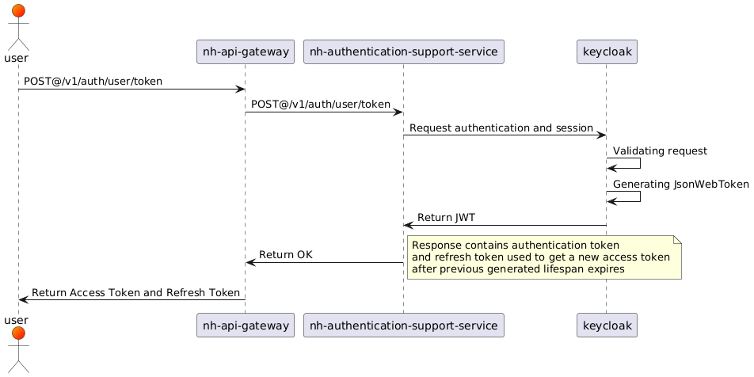
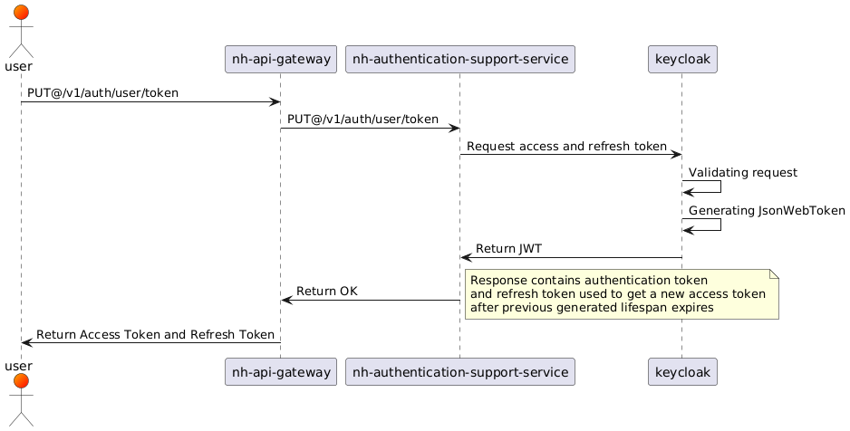
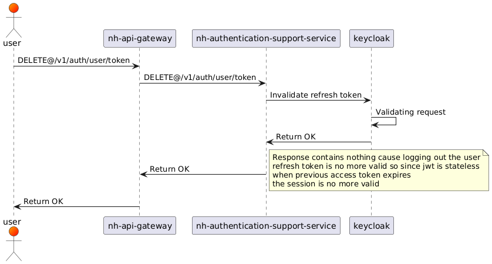
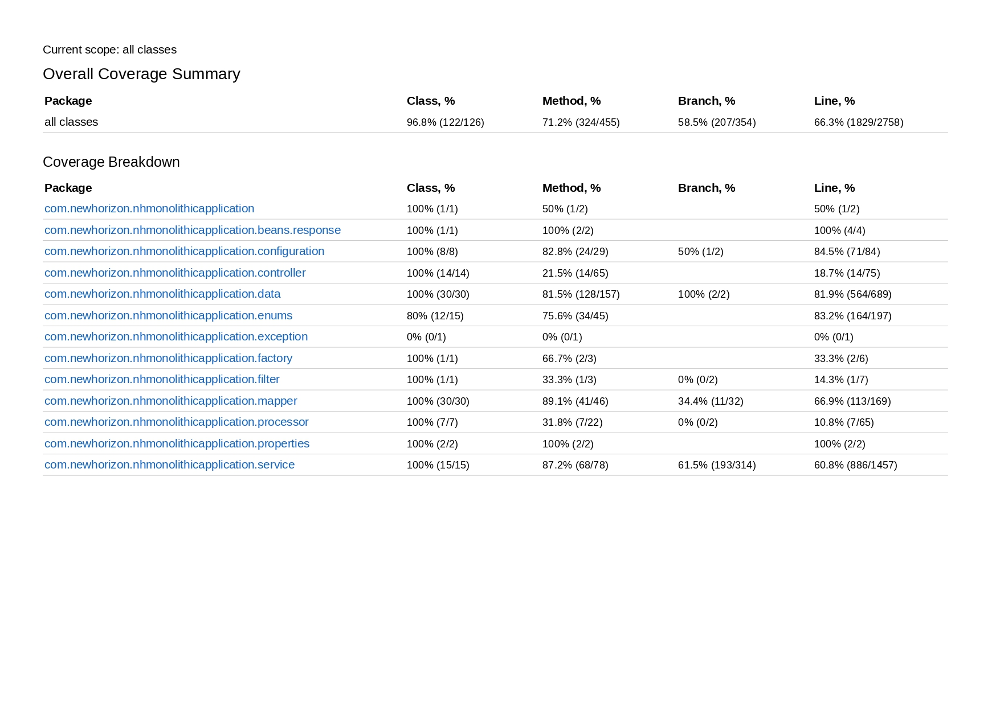

---
bibliography:
- bibliography/reference.bib
---

[POLITECNICO DI MILANO]{.smallcaps}

Facoltà di ingegneria

Corso di laurea in Ingegneria Informatica

Dipartimento di Elettronica e Informazione

{width="40%"}

**New-Horizon: nuovo sistema medicale per la gestione ospedaliera,
medica e infermieristica**

Autore: Russi Antonio

Relatore: Prof. Brambilla Marco

Anno Accademico 2024/2025

*\"Una piccola crepa non significa che sei rotto, significa che sei
stato messo alla prova e non sei andato in pezzi\"*

Introduzione {#introduzione .unnumbered}
============

New-Horizon è un progetto con lo scopo unico di rendere più moderna e
unificata la gestione dei reparti ospedalieri, dei pazienti, delle
strumentazioni e di qualsiasi altra parte che concerne la vita
ospedaliera e i processi dei dipendenti e dei pazienti.

Contesto e Motivazione {#contesto-e-motivazione .unnumbered}
----------------------

Nel panorama attuale dello sviluppo software, l'architettura a
microservizi sta guadagnando sempre più popolarità grazie alla sua
capacità di scalabilità, modularità e resilienza. Le aziende di ogni
settore stanno adottando i microservizi per migliorare la gestione delle
loro applicazioni e garantire una maggiore agilità nello sviluppo e
nella manutenzione del software. Rispetto ai sistemi monolitici, i
microservizi permettono di ridurre i tempi di rilascio e di ottimizzare
l'allocazione delle risorse computazionali. Questo progetto si propone
di analizzare le principali caratteristiche dei microservizi,
confrontandoli con le architetture monolitiche tradizionali, e di
implementare un sistema basato su microservizi utilizzando tecnologie
moderne come Spring Boot e API REST. Inoltre, verranno approfondite le
tecniche di deployment e di gestione della comunicazione tra i servizi,
con particolare attenzione alla sicurezza e alla scalabilità del
sistema.

Obiettivi del progetto {#obiettivi-del-progetto .unnumbered}
----------------------

L'obiettivo principale di questa tesi è sviluppare un'architettura a
microservizi per la gestione di un sistema informativo, con particolare
attenzione alla gestione di reparti, esami, pazienti, farmaci e
strumentazione ospedaliera. Il progetto include la scelta delle
tecnologie più adatte, la progettazione dell'architettura e
l'implementazione di un API Gateway per l'integrazione dei servizi.
Inoltre, verranno analizzate le strategie di autenticazione e
autorizzazione per garantire la sicurezza del sistema e verranno
proposte soluzioni per il monitoraggio e il logging delle operazioni.

Fondamenti Teorici
==================

Architettura a Microservizi: Definizione e vantaggi
---------------------------------------------------

L'architettura di microservizi suddivide un'applicazione in una serie di
servizi distribuibili in modo indipendente che comunicano tramite API.
In questo modo, ogni singolo servizio può essere distribuito e
ridimensionato in maniera indipendente. Questo approccio consente di
distribuire in modo rapido e frequente le applicazioni grandi e
complesse. A differenza delle applicazioni monolitiche, l'architettura
di microservizi consente ai team di implementare nuove funzioni e
apportare modifiche più rapidamente, senza dover riscrivere gran parte
del codice esistente [@atlassian_architettura_nodate]. Alcune
caratteristiche chiave dell'architettura a microservizi sono:

-   **Servizi con componenti multipli** I microservizi sono costituiti
    da servizi con componenti debolmente accoppiati che possono essere
    sviluppati, distribuiti, utilizzati, modificati e ridistribuiti
    senza compromettere il funzionamento degli altri servizi o
    l'integrità dell'applicazione. Ciò consente di distribuire in modo
    rapido e semplice le singole funzioni di un'applicazione
    [@atlassian_architettura_nodate].

-   **Elevate capacità di manutenzione e test** I microservizi
    consentono ai team di sperimentare nuove funzioni ed eseguire il
    rollback se qualcosa va storto. Ciò semplifica l'aggiornamento del
    codice e accelera il time-to-market delle nuove funzioni. Inoltre,
    semplifica il processo di isolamento e correzione degli errori e dei
    bug nei singoli servizi [@atlassian_architettura_nodate].

-   **Di proprietà di piccoli team** In genere, i team piccoli e
    indipendenti creano un servizio all'interno dei microservizi, per
    questo motivo sono incoraggiati ad adottare le pratiche Agile e
    DevOps. I team hanno la possibilità di lavorare in modo indipendente
    e più rapidamente, riducendo i tempi del ciclo di sviluppo
    [@atlassian_architettura_nodate].

-   **Organizzazione in base alle funzionalità aziendali** Con i
    microservizi, è possibile organizzare i servizi in base alle
    funzionalità aziendali. I team sono interfunzionali e dispongono di
    tutte le competenze necessarie per sviluppare e soddisfare le
    singole funzionalità [@atlassian_architettura_nodate].

-   **Infrastruttura automatizzata** I team che si occupano della
    creazione e della gestione dei microservizi in genere utilizzano
    pratiche di automazione dell'infrastruttura come continuous
    integration (CI), continuous delivery (CD) e continuous deployment
    (anch'essa CD). Grazie a queste pratiche, i team possono creare e
    distribuire ciascun servizio in modo indipendente senza influire
    sugli altri team. Possono inoltre distribuire la nuova versione di
    un servizio fianco a fianco a quella precedente
    [@atlassian_architettura_nodate].

Differenze tra Microservizi e Architettura Monolitica
-----------------------------------------------------

A differenza delle architetture monolitiche, dove tutti i componenti
sono strettamente integrati in un'unica applicazione, i microservizi
comunicano tra loro attraverso API REST, riducendo il rischio di guasti
globali e facilitando l'aggiornamento dei singoli moduli.

Nell'architettura monolitica:

-   Tutte le funzionalità sono incluse in un'unica applicazione.

-   Le modifiche al codice possono richiedere il riavvio dell'intero
    sistema.

-   L'uso delle risorse è meno ottimizzato rispetto ai microservizi.

-   La scalabilità è più difficile da gestire, poiché è necessario
    ridimensionare l'intera applicazione piuttosto che solo i componenti
    richiesti.

Spring Boot: Introduzione a Spring Framework
--------------------------------------------

Java Spring Boot è uno strumento open source che semplifica l'utilizzo
di framework basati su Java per creare microservizi e app Web. Per
qualsiasi definizione di Spring Boot bisogna iniziare con Java, uno dei
linguaggi di sviluppo e una delle piattaforme di computing più popolari
per lo sviluppo di app. Gli sviluppatori di tutto il mondo iniziano il
loro viaggio nella codifica partendo da Java. Flessibile e intuitivo,
Java è il preferito degli sviluppatori per un'ampia varietà di app: app
per social media, Web, gaming, ma anche applicazioni aziendali e di rete
[@microsoft_spring_boot].

### Caratteristiche di Spring Boot

Spring è un **framework di sviluppo open-source per Java** che
semplifica la creazione di applicazioni aziendali complesse. È noto per
semplificare il processo di sviluppo e favorire la scalabilità delle
applicazioni [@vantaggi_spring_boot].

Le principali caratteristiche di Spring includono:

-   L'implementazione dell'**Inversion of Control (IoC)**, un concetto
    che trasferisce il controllo della creazione e gestione degli
    oggetti dal programmatore al framework e che riduce la complessità
    del codice [@vantaggi_spring_boot].

-   Si basa sul concetto di **dependency injection**, che permette di
    gestire le dipendenze tra gli oggetti in modo flessibile e modulare
    [@vantaggi_spring_boot].

-   Un supporto per la **gestione delle transazioni** e la creazione di
    applicazioni modulari con componenti indipendenti
    [@vantaggi_spring_boot].

Spring è molto diffuso in quanto framework ben consolidato e con una
vasta comunità di sviluppatori e sottoposto a numerosi test che lo
rendono utilizzabile per lo sviluppo di applicazioni di qualsiasi
dimensione [@vantaggi_spring_boot].

Tecnologie Utilizzate
---------------------

Nell'ottica di sviluppare un prodotto che dimostri una competenza
globale nell'ultilizzo di svariati applicativi e tools, di seguito sono
ripostati tutti gli strumenti utilizzati

### MySQL

MySQL è un sistema di gestione di database relazionali (RDBMS)
open-source, ampiamente utilizzato per la sua affidabilità, scalabilità
e velocità. Basato su SQL (Structured Query Language), MySQL è impiegato
in molte applicazioni web, tra cui siti di e-commerce, sistemi di
gestione dei contenuti e applicazioni aziendali. Supporta transazioni,
replica, clustering e diverse modalità di storage, tra cui InnoDB, che
garantisce integrità referenziale e supporto per transazioni ACID. È
compatibile con vari linguaggi di programmazione, come PHP, Java e
Python, ed è parte integrante di stack tecnologici come LAMP (Linux,
Apache, MySQL, PHP/Python/Perl).

### MinIO

MinIO è una soluzione di storage distribuito compatibile con lo standard
Amazon S3, progettata per gestire dati non strutturati su larga scala. È
ottimizzato per l'uso in ambienti cloud-native e può essere utilizzato
per archiviare grandi volumi di dati, come file multimediali, log,
backup e dati per machine learning. Grazie alla sua architettura leggera
e scalabile, MinIO può essere eseguito su qualsiasi infrastruttura, da
piccoli server locali a grandi cluster distribuiti. Supporta
funzionalità avanzate come versioning, crittografia e replica dei dati.

### Spring Boot

Spring Boot è un framework basato su Java che semplifica lo sviluppo di
applicazioni enterprise e microservizi. Fa parte dell'ecosistema Spring
e fornisce un insieme di strumenti per la configurazione automatica,
riducendo la complessità dell'implementazione. Grazie a Spring Boot, gli
sviluppatori possono creare rapidamente applicazioni web, API RESTful e
servizi cloud-native, senza la necessità di configurazioni manuali
complesse. Include funzionalità integrate per sicurezza, gestione delle
dipendenze e monitoraggio.

### Keycloak

Keycloak è una soluzione open-source per la gestione dell'autenticazione
e dell'autorizzazione basata su Single Sign-On (SSO), OAuth2, OpenID
Connect e SAML. Consente alle applicazioni di integrare facilmente
funzionalità di login, gestione degli utenti e controllo degli accessi.
Grazie alla sua interfaccia intuitiva e alle API REST, Keycloak è
ampiamente utilizzato per centralizzare l'autenticazione in architetture
cloud-native e microservizi. Supporta anche l'integrazione con provider
di identità esterni, come LDAP e Active Directory.

### Kubernetes

Kubernetes è una piattaforma open-source per l'orchestrazione di
container, progettata per automatizzare il deployment, la gestione e il
scaling di applicazioni containerizzate. Basato su un'architettura a
cluster, Kubernetes gestisce in modo efficiente risorse hardware,
networking e bilanciamento del carico, garantendo alta disponibilità e
resilienza. Supporta funzionalità come auto-scaling, service discovery,
rolling updates e gestione dei volumi persistenti, rendendolo uno
strumento essenziale per ambienti cloud-native.

### Docker

Docker è una piattaforma per la creazione, distribuzione ed esecuzione
di applicazioni in container. Un container è un'unità leggera e
portabile che include tutto il necessario per eseguire un'applicazione,
eliminando problemi di compatibilità tra ambienti di sviluppo, test e
produzione. Docker semplifica il deployment di applicazioni su qualsiasi
infrastruttura, migliorando la scalabilità e la sicurezza. Con Docker
Compose, è possibile definire e gestire facilmente applicazioni
multi-container.

Requisiti Funzionali
====================

Gestione del Calendario
-----------------------

Essendo il sistema in grado di fissare appuntamenti tra medico e
paziente, il sistema permette di gestire un semplice calendario per la
prenotazione di visite mediche. La gestione del calendario prevede le
seguenti funzionalità:

-   Creazione del calendario

-   Creazione dell'evento

-   Retrieve degli eventi del calendario

-   Retrieve dei calendari appartenenti all'utente

Gestione dei Reparti
--------------------

Un ospedale è fondamentalmente costituito da reparti quindi l'altro
compito fondamentale del software è quello di permettere di gestire il
censimento dei reparti e tutto il resto che ne compete La gestione dei
reparti prevede le seguenti funzionalità:

-   Creazione dei reparti

-   Censimento delle camere dei reparti

-   Censimento dei letti delle camere dei reparti

-   Assegnazione posto letto paziente

-   Rimozione posto letto paziente

Gestione dei Dispositivi Medicali
---------------------------------

Solitamente, i pazienti non ricevono un monitoraggio 24/7, basato sulla
degenza, attraverso dispositivi come monitor multi-parametrici o altri.
All'interno del progetto è stato ipotizzato un mondo idealistico in cui
il monitoraggio del paziente viene preso sul serio e quindi ogni
paziente riceve in assegnazione dei dispositivi tra cui monitor
multi-parametrici per il monitoraggio costante dei parametri vitali. La
gestione dei dispositivi medicali prevede le seguenti funzionalità:

-   Creazione di dispositivi medicali

-   Assegnazione dispositivi medicali al paziente

-   Rimozione dispositivi medicali dal paziente

-   Abilitazione e disabilitazione dei dispositivi

-   Inserimento dati rilevati in time-series database

Gestione del Pronto Soccorso
----------------------------

Dal momento che tutta la gestione del software prevede che il paziente
debba arrivare dal pronto soccorso e man mano scorrere all'interno
dell'ospedale attraverso reparti e procedure, è di fondamentale
importanza la gestione del pronto soccorso La gestione del pronto
soccorso prevede le seguenti funzionalità:

-   Creazione del paziente

-   Apertura della cartella clinica

-   Caricamento dei documenti di pronto soccorso

-   Trasferimento in reparto sempre attraverso il caricamento dei
    documenti(ma non gestito automaticamente dal sistema)

Gestione degli Esami Clinici
----------------------------

Essendo la parte di screening del paziente affiancata dalla possibilità
di eseguire esami clinici, il sistema permette di gestire esami di
laboratorio e non. Ovviamente viene gestita anche la possibilità di
creare nuove tipologie di esame correlato al censimento della
strumentazione utilizzata. La gestione degli esami prevede le seguenti
funzionalità:

-   Aggiunta di strumentazione

-   Aggiunta di tipologia di esame

-   Modifica della strumentazione

-   Prescrizione dell'esame al paziente

-   Rimozione prescrizione esame paziente

-   Aggiunta di risultati all'esame

-   Visione dei risultati dell'esame

Gestione della Cartella Clinica
-------------------------------

Di fondamentale importanza è la cartella clinica che, come si può vedere
all'interno della struttura del database tramite inizializzazione SQL,
rappresenta il punto unico di raccolta delle informazioni relative al
paziente all'interno di un lasso di tempo di permanenza in struttura. La
gestione della cartella clinica prevede le seguenti funzionalità:

-   Apertura della cartella clinica

-   Inserimento dei documenti relativi al pronto soccorso

Gestione delle Scale di Valutazione
-----------------------------------

Di fondamentale importanza sono le scale di valutazione che permettono
di avere nel tempo un quadro e monitoraggio delle funzionalità del
paziente La gestione delle scale di valutazione prevede le seguenti
funzionalità:

-   Creazione di un record

-   Visualizzazione di tutte le scale

Gestione del Paziente
---------------------

Dal momento che tutto l'ospedale gravita attorno al paziente, dobbiamo
avere la possibilità dio gestire alcune cose semplici quindi. La
gestione del paziente prevede le seguenti funzionalità:

-   Creazione del paziente

-   Retrieve dell'anagrafica del paziente

-   Assegnazione e modifica della residenza e del domicilio

Gestione delle Operazioni Chirurgiche e delle Sale Chirurgiche
--------------------------------------------------------------

Dovendosi ritenere necessaria un operazione chirurgica, vi è la
possibilità di schedulare interventi e gestirli. La gestione delle
operazioni e delle sale prevede le seguenti funzionalità:

-   Creazione tipologia operazione

-   Creazione sala chirurgica

-   Scheduling dell'operazione

-   Rimozione dell'operazione

-   Posticipazione dell'operazione

-   Assegnazione team medico

-   Rimozione team medico

Gestione della Scheda di Terapia del Paziente
---------------------------------------------

Dal momento che il paziente entra in reparto inizia un periodo, più o
meno lungo di degenza ospedaliera, all'interno della quale dovrà
sottoporti a una possibile terapia farmacologica, prescritta dal medico
competente, che viene somministrata dal personale infermieristico La
gestione della scheda di terapia prevede le seguenti funzionalità:

-   Creazione della scheda di terapia

-   Assegnazione dei farmaci all'interno della terapia

-   Check della avvenuta somministrazione dei farmaci

Gestione dei Turni di Lavoro
----------------------------

Essendo un ospedale sopratutto un luogo di lavoro, vi è la possibilità
di gestire i turni del personale. Ricorda che in questo ospedale non è
ancora permesso prendere giorni di ferie o di malattia. La gestione dei
turni di lavoro prevede le seguenti funzionalità:

-   Generazione automatica dei turni mensili

-   Aggiornamento del singolo turno

-   Retrieve dei turni mensili

Progettazione Sistema
=====================

Architettura
------------

Essendo un sistema di una certa complessità, è stata necessaria la
suddivisione in servizi più manutenibili e gestibili. Architetturalmente
abbiamo i seguenti componenti:

-   **nh-api-gateway** servizio Spring fondamentale perché ci permette
    di centralizzare tutte le logiche di sicurezza e di instradare
    secondo RBAC il traffico verso i servizi sottostanti

-   **nh-authentication-support-service** servizio Spring che permette
    le interazioni con Keycloak come identity provider e per la gestione
    esternalizzata di JWT e OAuth2

-   **nh-monolithic-application** servizio Spring che mantiene il cuore
    pulsante di tutta l'architettura e che si occupa di tutta la
    gestione dei punti dell'introduzione

-   **nh-fast-service** servizio Python che si occupa di propagare la
    comunicazione di registrazione paziente e personale sia al servizio
    monolitico che al servizio di comuncazione con keycloak

{#fig:arcitecture.png
width="\\linewidth"}

Api Gateway
-----------

**nh-api-gateway** rappresenta il primo livello di interfacciamento con
il resto del sistema. Esso infatti è responsabile dell'instradamento del
traffico verso le componenti interne del sistema e quindi ha il compito
di comunicare con:

-   **nh-authentication-support-service** per poter gestire login,
    refresh e logout dell'utente all'interno del sistema attraverso il
    servizio keycloak

-   **keycloak** per poter ottenere i certificati per la validazione dei
    jwt lungo le rotte private del gateway

-   **nh-monolithic-application** per poter effettivamente usare le
    implementazioni del sistema ospedaliero in toto

-   **nh-fast-service** per poter generare in maniera sincrona l'utenza
    del paziente o del personale sia all'interno del sistema che
    all'interno di keycloak

#### Accesso personale vs. Accesso pubblico

Essendo il sistema accessibile da due figure distinte ovvero

-   personale dipendente della struttura

-   paziente in cura alla struttura

è stato necessario configurare due istante di api-gateway che fanno
riferimento a due realm diversi all'interno di keycloak attraverso due
istanze diverse di **nh-authentication-support-service** infatti avremo

{#fig:api-gateway.png
width="\\linewidth"}

Authentication Support Service
------------------------------

**nh-authentication-support-service** è il servizio che ha il compito di
interfacciarsi con kaycloak che, nel caso specifico, si occupa del
mantenimento e della gestione di tutte le utenze presenti all'interno
del sistema e ci permette di poter gestire facilmente la multi-tenancy
per avere utenze distinte tra personale lavoratore della struttura e
pazienti che visionano esternamente i dati in maniera controllata e
supervisionata dall'api-gateway configurato appositamente. Come mostrato
nella sezione precedente, il servizio viene configurato in due diversi
modi infatti keycloak avrà la seguente configurazione:

-   realm **new-horizon-internal**

-   realm **new-horizon-external**

I due realm distinti permettono di distinguere le utenze tra il
personale interno e le utenze esterne di accesso meno privilegiato.
Keycloak, permettendoci di lavorare in stateless, fornirà JWT per
l'accesso agli endpoint e JWT per il refresh del JWT di accesso. I
principali flussi esposti dal servizio sono:

#### Login

Flusso di login che mostra solo il caso di SUCCESS

{#fig:login.png
width="\\linewidth"}

#### Refresh

Flusso di refresh che mostra solo il caso di SUCCESS

{#fig:refresh.png
width="\\linewidth"}

#### Logout

Flusso di logout che mostra solo il caso di SUCCESS

{#fig:logout.png
width="\\linewidth"}

Monolithic Application
----------------------

**nh-monolithic-application** è il servizio principale che permette a
tutto il sistema di svolgere il compito per cui è stato studiato. Come
inserito nella introduzione, i compiti principali del monolite sono:

-   Gestire il calendario

-   Gestire il reparto

-   Gestire il dispositivo

-   Gestire il pronto soccorso

-   Gestire l'esame

-   Gestire la cartella clinica

-   Gestire il personale

-   Gestire la scala di valutazione

-   Gestire il paziente

-   Gestire il farmaco

-   Gestire il turni del personale

-   Gestire l'intervento

-   Gestire la terapia farmacologica

Di seguito verrà riportata la struttura di ogni singolo controller per
l'interfacciamento con i possibili codici di risposta. Alcuni controller
non hanno tutti i metodi implementati causa mancanza di tempo per gli
sviluppi ma al fine della presentazione verranno inseriti per evitare
interruzioni.

#### Persistenza

La gestione della persistenza in un progetto di questa portata è di
fondamentale importanza pertanto è stato necessario introdurre un tool
che ci permette di mantenere la consistenza del database in caso di
errore da parte di un possibile sviluppatore. Il tool in questione è
liquibase che ci permette di definire gli script sql che vengono
eseguiti per generare il database. Tutti gli script possono essere
visualizzati all'interno di **nh-monolithic-application** al path
**classpath:/db/changelog/**. I file sono di proposito numerati con un
numero a tre cifre in modo tale che l'esecuzione sia in ordine di
inserimento e non alfabetico.

#### Diagrammi di Flusso

Generalizzando il comportamento di ogni endpoint presente all'interno
del sistema avremo un comportamento come segue.

{#fig:generic.png
width="\\linewidth"}

In generale ogni servizio del sistema esegue una serie di validazioni
per processare la richiesta e torna codici di errore distinti in caso ci
sia un errore controllato o non controllato. Di seguito vengono
riportati i controller con i relativi metodi

1.  **CalendarController**

    1.  **Crea un nuovo calendario** *POST
        localhost:8080/nh-monolithic-application/v1/calendar* Possibili
        codici risposta:

        -   OK

        -   MEDICAL\_MEMBER\_NOT\_FOUND

        -   MEDICAL\_CALENDAR\_ALREADY\_EXISTS

        -   GENERIC\_ERROR

    2.  **Crea un nuovo evento** *POST
        localhost:8080/nh-monolithic-application/v1/calendar/event*
        Possibili codici di errore:

        -   OK

        -   MEDICAL\_CALENDAR\_NOT\_FOUND

        -   SCHEDULING\_CONFLICT

        -   PATIENT\_NOT\_FOUND

        -   GENERIC\_ERROR

    3.  **Recupera calendari personali** *GET
        localhost:8080/nh-monolithic-application/v1/calendar/list*
        Possibili codici di errore:

        -   OK

        -   MEDICAL\_MEMBER\_NOT\_FOUND

    4.  **Recupera eventi del calendario** *GET
        localhost:8080/nh-monolithic-application/v1/calendar/events*
        Possibili codici di errore:

        -   OK

        -   MEDICAL\_MEMBER\_NOT\_FOUND

        -   MEDICAL\_CALENDAR\_NOT\_FOUND

        -   CALENDAR\_DO\_NOT\_BELONG\_TO\_USER

        -   GENERIC\_ERROR

2.  **DepartmentController**

    1.  **Crea un nuovo reparto** *POST
        localhost:8080/nh-monolithic-application/v1/department*
        Possibili codici di errore:

        -   OK

        -   DEPARTMENT\_ALREADY\_EXISTS

        -   GENERIC\_ERROR

    2.  **Crea una nuova camera** *POST
        localhost:8080/nh-monolithic-application/v1/department/room*
        Possibili codici di errore:

        -   OK

        -   DEPARTMENT\_NOT\_FOUND

        -   ROOM\_ALREADY\_EXISTS

        -   GENERIC\_ERROR

    3.  **Crea un nuovo posto letto** *POST
        localhost:8080/nh-monolithic-application/v1/department/room/bed*
        Possibili codici di errore:

        -   OK

        -   DEPARTMENT\_NOT\_FOUND

        -   ROOM\_NOT\_FOUND

        -   GENERIC\_ERROR

    4.  **Assegna posto letto al paziente** *POST
        localhost:8080/nh-monolithic-application/v1/department/room/bed/assign*
        Possibili codici di errore:

        -   OK

        -   PATIENT\_NOT\_FOUND

        -   DEPARTMENT\_NOT\_FOUND

        -   ROOM\_NOT\_FOUND

        -   BED\_NOT\_FOUND

        -   BED\_ALREADY\_ASSIGNED

        -   GENERIC\_ERROR

    5.  **Rimuovi assegnazione posto letto dal paziente** *DELETE
        localhost:8080/nh-monolithic-application/v1/department/room/bed/assign*
        Possibili codici di errore:

        -   OK

        -   PATIENT\_NOT\_FOUND

        -   DEPARTMENT\_NOT\_FOUND

        -   ROOM\_NOT\_FOUND

        -   BED\_NOT\_FOUND

        -   BED\_NOT\_ASSIGNED

        -   PATIENT\_NOT\_ASSIGNED\_TO\_GIVEN\_BED

        -   GENERIC\_ERROR

3.  **DeviceController**

    1.  **Genera credenziali per device** *POST
        localhost:8080/nh-monolithic-application/v1/device/login*
        Possibili codici di errore:

        -   NOT\_IMPLEMENTED

    2.  **Registra un nuovo device** *POST
        localhost:8080/nh-monolithic-application/v1/device* Possibili
        codici di errore:

        -   OK

        -   DEVICE\_ALREADY\_EXISTS

        -   GENERIC\_ERROR

    3.  **Update device** *PUT
        localhost:8080/nh-monolithic-application/v1/device* Possibili
        codici di errore:

        -   NOT\_IMPLEMENTED

    4.  **Assegna device a un paziente** *POST
        localhost:8080/nh-monolithic-application/v1/device/assign*
        Possibili codici di errore:

        -   OK

        -   PATIENT\_NOT\_FOUND

        -   DEVICE\_NOT\_FOUND

        -   DEVICE\_NOT\_ENABLED

        -   DEVICE\_ALREADY\_ASSIGNED

        -   GENERIC\_ERROR

    5.  **Elimina assegnazione device da un paziente** *DELETE
        localhost:8080/nh-monolithic-application/v1/device/assign*
        Possibili codici di errore:

        -   OK

        -   PATIENT\_NOT\_FOUND

        -   DEVICE\_NOT\_FOUND

        -   DEVICE\_NOT\_ENABLED

        -   PATIENT\_NOT\_ASSIGNED\_TO\_GIVEN\_DEVICE

        -   GENERIC\_ERROR

    6.  **Abilita o disabilita device** *POST
        localhost:8080/nh-monolithic-application/v1/device/toggle*
        Possibili codici di errore:

        -   OK

        -   DEVICE\_NOT\_FOUND

        -   GENERIC\_ERROR

4.  **EmergencyRoomController**

    1.  **Upload documenti dal pronto soccorso** *POST
        localhost:8080/nh-monolithic-application/v1/er/document*
        Possibili codici di errore:

        -   OK

        -   PATIENT\_NOT\_FOUND

        -   MEDICAL\_CHART\_NOT\_FOUND

        -   ERROR\_UPLOADING\_ER\_DOCUMENT

        -   GENERIC\_ERROR

5.  **ExamController**

    1.  **Recupera esame** *GET
        localhost:8080/nh-monolithic-application/v1/exam* Possibili
        codici di errore:

        -   NOT\_IMPLEMENTED

    2.  **Prescrivi esame** *POST
        localhost:8080/nh-monolithic-application/v1/exam* Possibili
        codici di errore:

        -   OK

        -   PATIENT\_NOT\_FOUND

        -   EXAM\_CODE\_NOT\_FOUND

        -   MEDICAL\_CHART\_NOT\_FOUND

        -   GENERIC\_ERROR

    3.  **Upload risultati esame** *POST
        localhost:8080/nh-monolithic-application/v1/exam/result*
        Possibili codici di errore:

        -   OK

        -   PRESCRIBED\_EXAM\_NOT\_FOUND

        -   ERROR\_UPLOADING\_EXAM\_RESULT

        -   GENERIC\_ERROR

    4.  **Retrieve risultati esame** *GET
        localhost:8080/nh-monolithic-application/v1/exam/result*
        Possibili codici di errore:

        -   OK

        -   PRESCRIBED\_EXAM\_NOT\_FOUND

        -   GENERIC\_ERROR

    5.  **Crea nuova tipologia esame** *POST
        localhost:8080/nh-monolithic-application/v1/exam/inventory/type*
        Possibili codici di errore:

        -   OK

        -   EXAM\_CODE\_ALREADY\_EXISTS

        -   GENERIC\_ERROR

    6.  **Crea macchina per esame** *POST
        localhost:8080/nh-monolithic-application/v1/exam/inventory/machine*
        Possibili codici di errore:

        -   OK

        -   EXAM\_CODE\_NOT\_FOUND

        -   MACHINE\_ALREADY\_EXISTS

        -   GENERIC\_ERROR

    7.  **Update macchina per esame** *PUT
        localhost:8080/nh-monolithic-application/v1/exam/inventory/machine*
        Possibili codici di errore:

        -   OK

        -   MACHINE\_NOT\_FOUND

        -   GENERIC\_ERROR

6.  **MedicalChartController**

    1.  **Crea nuova cartella clinica** *POST
        localhost:8080/nh-monolithic-application/v1/chart* Possibili
        codici di errore:

        -   OK

        -   PATIENT\_NOT\_FOUND

        -   MEDICAL\_CHART\_OPENED\_DETECTED

        -   GENERIC\_ERROR

7.  **MedicalTeamController**

    1.  **Crea un nuovo membro** *POST
        localhost:8080/nh-monolithic-application/v1/medical/member*
        Possibili codici di errore:

        -   OK

        -   MEDICAL\_MEMBER\_ALREADY\_EXISTS

        -   GENERIC\_ERROR

8.  **NursingRatingScaleController**

    1.  **Registra scala di valutazione** *POST
        localhost:8080/nh-monolithic-application/v1/nrs* Possibili
        codici di errore:

        -   OK

        -   PATIENT\_NOT\_FOUND

        -   NURSING\_RATING\_SCALE\_CODE\_NOT\_FOUND

        -   MEDICAL\_CHART\_NOT\_FOUND

        -   GENERIC\_ERROR

    2.  **Recupera tutte le scale di valutazione** *POST
        localhost:8080/nh-monolithic-application/v1/nrs/all* Possibili
        codici di errore:

        -   OK

        -   MEDICAL\_CHART\_NOT\_FOUND

        -   GENERIC\_ERROR

9.  **PatientController**

    1.  **Recupera i miei pazienti attualmente seguiti** *POST
        localhost:8080/nh-monolithic-application/v1/patient/myPatientList*
        Possibili codici di errore:

        -   OK

        -   MEDICAL\_MEMBER\_NOT\_FOUND

        -   GENERIC\_ERROR

    2.  **Recupera i miei pazienti attualmente seguiti** *POST
        localhost:8080/nh-monolithic-application/v1/patient/myPatientList*
        Possibili codici di errore:

        -   OK

        -   MEDICAL\_MEMBER\_NOT\_FOUND

        -   GENERIC\_ERROR

    3.  **Genera chiamata di telemedicina** *POST
        localhost:8080/nh-monolithic-application/v1/patient/meet*
        Possibili codici di errore:

        -   OK

        -   GENERIC\_ERROR

    4.  **Registra paziente al sistema** *POST
        localhost:8080/nh-monolithic-application/v1/patient* Possibili
        codici di errore:

        -   OK

        -   PATIENT\_ALREADY\_EXISTS

        -   GENDER\_NOT\_FOUND

        -   GENERIC\_ERROR

    5.  **Recupera anagrafica paziente** *GET
        localhost:8080/nh-monolithic-application/v1/patient/anagrafica*
        Possibili codici di errore:

        -   OK

        -   PATIENT\_NOT\_FOUND

        -   GENDER\_NOT\_FOUND

        -   GENERIC\_ERROR

    6.  **Assegna medico al paziente** *POST
        localhost:8080/nh-monolithic-application/v1/patient/assignDoctor*
        Possibili codici di errore:

        -   OK

        -   MEDICAL\_MEMBER\_NOT\_FOUND

        -   PATIENT\_NOT\_FOUND

        -   MEDICAL\_CHART\_NOT\_FOUND

        -   GENERIC\_ERROR

10. **PharmacyController**

    1.  **Crea nuovo farmaco** *POST
        localhost:8080/nh-monolithic-application/v1/pharmacy/drug*
        Possibili codici di errore:

        -   OK

        -   DRUG\_ALREADY\_EXISTS

        -   GENERIC\_ERROR

    2.  **Crea nuova confezione per farmaco** *POST
        localhost:8080/nh-monolithic-application/v1/pharmacy/drug/package*
        Possibili codici di errore:

        -   OK

        -   DRUG\_NOT\_FOUND

        -   DRUG\_PACKAGE\_ALREADY\_EXISTS

        -   GENERIC\_ERROR

    3.  **Ritira confezione o confezioni di un farmaco** *POST
        localhost:8080/nh-monolithic-application/v1/pharmacy/withdraw*
        Possibili codici di errore:

        -   OK

        -   DRUG\_PACKAGE\_NOT\_FOUND

        -   DRUG\_QUANTITY\_NOT\_AVAILABLE

        -   GENERIC\_ERROR

    4.  **Aggiorna fornitura di un farmaco** *PUT
        localhost:8080/nh-monolithic-application/v1/pharmacy/drug*
        Possibili codici di errore:

        -   OK

        -   DRUG\_PACKAGE\_NOT\_FOUND

        -   GENERIC\_ERROR

11. **ShiftController**

    1.  **Autogenerazione turni mensili** *POST
        localhost:8080/nh-monolithic-application/v1/shift/generate*
        Possibili codici di errore:

        -   OK

        -   MEDICAL\_MEMBER\_NOT\_FOUND

        -   WORK\_SHIFT\_CODE\_NOT\_FOUND

        -   GENERIC\_ERROR

    2.  **Modifica singolo turno** *PUT
        localhost:8080/nh-monolithic-application/v1/shift* Possibili
        codici di errore:

        -   OK

        -   MEDICAL\_MEMBER\_NOT\_FOUND

        -   WORK\_SHIFT\_CODE\_NOT\_FOUND

        -   GENERIC\_ERROR

    3.  **Recupera turni del mese** *GET
        localhost:8080/nh-monolithic-application/v1/shift* Possibili
        codici di errore:

        -   OK

        -   MEDICAL\_MEMBER\_NOT\_FOUND

        -   GENERIC\_ERROR

12. **SurgeryController**

    1.  **Programma operazione** *POST
        localhost:8080/nh-monolithic-application/v1/surgery/schedule*
        Possibili codici di errore:

        -   OK

        -   PATIENT\_NOT\_FOUND

        -   MEDICAL\_CHART\_NOT\_FOUND

        -   SURGERY\_TYPE\_NOT\_FOUND

        -   SURGICAL\_ROOM\_NOT\_FOUND

        -   SURGERY\_START\_AFTER\_END

        -   SCHEDULING\_CONFLICT

        -   GENERIC\_ERROR

    2.  **Elimina operazione programmata** *DELETE
        localhost:8080/nh-monolithic-application/v1/surgery/schedule*
        Possibili codici di errore:

        -   OK

        -   SCHEDULED\_SURGERY\_NOT\_FOUND

        -   GENERIC\_ERROR

    3.  **Riprogramma operazione programmata** *PUT
        localhost:8080/nh-monolithic-application/v1/surgery/schedule*
        Possibili codici di errore:

        -   OK

        -   SCHEDULED\_SURGERY\_NOT\_FOUND

        -   SCHEDULING\_CONFLICT

        -   GENERIC\_ERROR

    4.  **Crea sala operatoria** *POST
        localhost:8080/nh-monolithic-application/v1/surgery/room*
        Possibili codici di errore:

        -   OK

        -   SURGICAL\_ROOM\_ALREADY\_EXISTS

        -   SURGICAL\_ROOM\_TYPE\_NOT\_FOUND

        -   GENERIC\_ERROR

    5.  **Crea tipologia sala operatoria** *POST
        localhost:8080/nh-monolithic-application/v1/surgery/room/type*
        Possibili codici di errore:

        -   OK

        -   SURGERY\_TYPE\_ALREADY\_EXISTS

        -   GENERIC\_ERROR

13. **TherapyController**

    1.  **Creazione scheda di terapia** *POST
        localhost:8080/nh-monolithic-application/v1/therapy/sut*
        Possibili codici di errore:

        -   OK

        -   PATIENT\_NOT\_FOUND

        -   MEDICAL\_MEMBER\_NOT\_FOUND

        -   MEDICAL\_CHART\_NOT\_FOUND

        -   GENERIC\_ERROR

    2.  **Asseganzione terapia** *Per terapia si intende l'assegnazione
        del singolo farmaco nelle quantità indicate* *POST
        localhost:8080/nh-monolithic-application/v1/therapy* Possibili
        codici di errore:

        -   OK

        -   SUT\_NOT\_FOUND

        -   MEDICAL\_MEMBER\_NOT\_FOUND

        -   DRUG\_PACKAGE\_NOT\_FOUND

        -   ADMINISTRATION\_TYPE\_CODE\_NOT\_FOUND

        -   TREATMENT\_ALREADY\_IN\_SUT

        -   GENERIC\_ERROR

    3.  **Segna somministrazioni** *POST
        localhost:8080/nh-monolithic-application/v1/therapy/check*
        Possibili codici di errore:

        -   OK

        -   THERAPY\_ENTRY\_NOT\_FOUND

        -   MEDICAL\_MEMBER\_NOT\_FOUND

        -   ADMINISTRATION\_STATUS\_CODE\_NOT\_FOUND

        -   ADMINISTRATION\_NUMBER\_REACHED

        -   GENERIC\_ERROR

#### Testing

Per ottenere un prodotto testato e stabile, sono stati scritti test di
integrazione che sfruttano la tecnologia di Testcontainers per creare
dei container durante l'esecuzione dei test che permettono il testing di
tutte le parti del codice senza la necessità di dover mokkare
informazioni. Questo è stato possibile poichè il sistema non esegue
chiamate esterne ma sfrutta direttamente le dipendenze dei container per
poter eseguire il testing. Nel caso in cui l'applicativo avesse
effettuato chiamate web all'esterno, in tal caso sarebbe stato
necessario inserire dei mock. Sempre per affiancare lo sviluppo dei test
con metodi più flessibili è stato utilizzato Instancio come tool per
semplificare la creazione degli oggetti di request per i service
testati. D'altronde la bravura non è solo nello scrivere il codice ma
anche saper utilizzare le tecnologie. Di seguito l'attuale coverage

{#fig:coverage.png
width="\\linewidth"}

Fast Service
------------

**nh-fast-service** è un servizio scritto interamente in python che
permette in maniera snella di interfacciarsi con keycloak per la
creazione di nuovi utenti e inoltrare la stessa richiesta al
**nh-monolithic-application** per poter eseguire la stessa operazione
sul sistema

#### Creazione paziente

La creazione del paziente segue il diagramma seguente

{#fig:patient_register.png
width="\\linewidth"}

Come si può osservare la creazione prevede l'interazione sia con il
sistema di keycloak sia con il microservizio monolite principale

#### Creazione utente interno

La creazione del dipendente segue il diagramma seguente

{#fig:worker_register.png
width="\\linewidth"}

Come si può osservare la creazione prevede l'interazione sia con il
sistema di keycloak sia con il microservizio monolite principale

Codici di Risposta
------------------

Di seguito sono riportati tutti i codici di risposta della piattaforma.

  **ErrorCode**   **Content**
  --------------- -------------------------------------------------------------------------
  0               EnumName: OK
                  Description:
                  HttpStatus: 200 OK
                  InternalStatus: SUCCESS
  1               EnumName: OK\_EMPTY
                  Description: Empty response
                  HttpStatus: 204 NO\_CONTENT
                  InternalStatus: SUCCESS
  -101            EnumName: BAD\_CREDENTIALS
                  Description: Invalid credentials
                  HttpStatus: 401 UNAUTHORIZED
                  InternalStatus: FAILURE
  -102            EnumName: INVALID\_CLIENT\_CONFIGURATION
                  Description: Invalid auth client configuration
                  HttpStatus: 503 SERVICE\_UNAVAILABLE
                  InternalStatus: FAILURE
  -103            EnumName: UNHAUTORIZED\_CLIENT
                  Description: Auth client is not authorized to perform invoked operation
                  HttpStatus: 500 INTERNAL\_SERVER\_ERROR
                  InternalStatus: FAILURE
  -104            EnumName: BAD\_GRANT\_TYPE
                  Description: Unsupported grant type
                  HttpStatus: 503 SERVICE\_UNAVAILABLE
                  InternalStatus: FAILURE
  -401            EnumName: BAD\_PARAMETER
                  Description: Bad input parameters
                  HttpStatus: 400 BAD\_REQUEST
                  InternalStatus: FAILURE
  -402            EnumName: UNAUTHORIZED
                  Description: Unauthorized
                  HttpStatus: 401 UNAUTHORIZED
                  InternalStatus: FAILURE
  -500            EnumName: GENERIC\_ERROR
                  Description: Generic Error
                  HttpStatus: 500 INTERNAL\_SERVER\_ERROR
                  InternalStatus: FAILURE
  -501            EnumName: NOT\_IMPLEMENTED
                  Description: Not Implemented
                  HttpStatus: 501 NOT\_IMPLEMENTED
                  InternalStatus: FAILURE
  -600            EnumName: DEPARTMENT\_ALREADY\_EXISTS
                  Description: Department already exists
                  HttpStatus: 400 BAD\_REQUEST
                  InternalStatus: FAILURE
  -601            EnumName: ROOM\_ALREADY\_EXISTS
                  Description: Room already exists
                  HttpStatus: 400 BAD\_REQUEST
                  InternalStatus: FAILURE
  -602            EnumName: DEPARTMENT\_NOT\_FOUND
                  Description: Department not found
                  HttpStatus: 404 NOT\_FOUND
                  InternalStatus: FAILURE
  -603            EnumName: ROOM\_NOT\_FOUND
                  Description: Room not found
                  HttpStatus: 404 NOT\_FOUND
                  InternalStatus: FAILURE
  -604            EnumName: BED\_NOT\_FOUND
                  Description: Bed not found
                  HttpStatus: 404 NOT\_FOUND
                  InternalStatus: FAILURE
  -605            EnumName: PATIENT\_NOT\_FOUND
                  Description: Patient not found
                  HttpStatus: 404 NOT\_FOUND
                  InternalStatus: FAILURE
  -606            EnumName: DEVICE\_ALREADY\_EXISTS
                  Description: Device already exists
                  HttpStatus: 400 BAD\_REQUEST
                  InternalStatus: FAILURE
  -607            EnumName: DEVICE\_NOT\_FOUND
                  Description: Device not found
                  HttpStatus: 404 NOT\_FOUND
                  InternalStatus: FAILURE
  -608            EnumName: DEVICE\_NOT\_ENABLED
                  Description: Device not enabled
                  HttpStatus: 400 BAD\_REQUEST
                  InternalStatus: FAILURE
  -609            EnumName: DEVICE\_ALREADY\_ASSIGNED
                  Description: Device already assigned
                  HttpStatus: 400 BAD\_REQUEST
                  InternalStatus: FAILURE
  -610            EnumName: DEVICE\_NOT\_ASSIGNED
                  Description: Device is not assigned
                  HttpStatus: 400 BAD\_REQUEST
                  InternalStatus: FAILURE
  -611            EnumName: PATIENT\_NOT\_ASSIGNED\_TO\_GIVEN\_DEVICE
                  Description: Provided patient is not assigned to given device
                  HttpStatus: 400 BAD\_REQUEST
                  InternalStatus: FAILURE
  -612            EnumName: BED\_ALREADY\_ASSIGNED
                  Description: Bed already assigned
                  HttpStatus: 400 BAD\_REQUEST
                  InternalStatus: FAILURE
  -613            EnumName: PATIENT\_NOT\_ASSIGNED\_TO\_GIVEN\_BED
                  Description: Provided patient is not assigned to given bed
                  HttpStatus: 400 BAD\_REQUEST
                  InternalStatus: FAILURE
  -614            EnumName: BED\_NOT\_ASSIGNED
                  Description: Bed is not assigned
                  HttpStatus: 400 BAD\_REQUEST
                  InternalStatus: FAILURE
  -615            EnumName: MEDICAL\_CHART\_OPENED\_DETECTED
                  Description: A medical chart open is detected
                  HttpStatus: 400 BAD\_REQUEST
                  InternalStatus: FAILURE
  -616            EnumName: EXAM\_CODE\_NOT\_FOUND
                  Description: Provided exam code do not exists
                  HttpStatus: 400 BAD\_REQUEST
                  InternalStatus: FAILURE
  -617            EnumName: MEDICAL\_CHART\_NOT\_FOUND
                  Description: Medical chart do not exists
                  HttpStatus: 400 BAD\_REQUEST
                  InternalStatus: FAILURE
  -618            EnumName: EXAM\_NOT\_ASSIGNED\_TO\_GIVEN\_PATIENT
                  Description: Provided exam is not assigned to given patient
                  HttpStatus: 400 BAD\_REQUEST
                  InternalStatus: FAILURE
  -619            EnumName: EXAM\_NOT\_REMOVABLE
                  Description: Exam is in a state that can not allow the deletion
                  HttpStatus: 400 BAD\_REQUEST
                  InternalStatus: FAILURE
  -620            EnumName: ERROR\_UPLOADING\_EXAM\_RESULT
                  Description: Error occurred uploading exam result
                  HttpStatus: 500 INTERNAL\_SERVER\_ERROR
                  InternalStatus: FAILURE
  -621            EnumName: EXAM\_CODE\_ALREADY\_EXISTS
                  Description: Exam with same code already exists
                  HttpStatus: 400 BAD\_REQUEST
                  InternalStatus: FAILURE
  -622            EnumName: MACHINE\_ALREADY\_EXISTS
                  Description: Machine serial already exists
                  HttpStatus: 400 BAD\_REQUEST
                  InternalStatus: FAILURE
  -623            EnumName: MACHINE\_NOT\_FOUND
                  Description: Machine not found
                  HttpStatus: 400 BAD\_REQUEST
                  InternalStatus: FAILURE
  -624            EnumName: SURGICAL\_ROOM\_ALREADY\_EXISTS
                  Description: Surgical Room already exists
                  HttpStatus: 400 BAD\_REQUEST
                  InternalStatus: FAILURE
  -625            EnumName: SURGICAL\_ROOM\_NOT\_FOUND
                  Description: Machine not found
                  HttpStatus: 404 NOT\_FOUND
                  InternalStatus: FAILURE
  -626            EnumName: SURGICAL\_ROOM\_TYPE\_NOT\_FOUND
                  Description: Surgical Room Type not found
                  HttpStatus: 404 NOT\_FOUND
                  InternalStatus: FAILURE
  -627            EnumName: SURGERY\_TYPE\_ALREADY\_EXISTS
                  Description: Surgery Type already exists
                  HttpStatus: 400 BAD\_REQUEST
                  InternalStatus: FAILURE
  -628            EnumName: SURGERY\_TYPE\_NOT\_FOUND
                  Description: Surgery Type not found
                  HttpStatus: 404 NOT\_FOUND
                  InternalStatus: FAILURE
  -629            EnumName: SURGERY\_START\_AFTER\_END
                  Description: Surgery start cannot be after surgery end
                  HttpStatus: 400 BAD\_REQUEST
                  InternalStatus: FAILURE
  -623            EnumName: SCHEDULING\_CONFLICT
                  Description: Scheduling conflict
                  HttpStatus: 409 CONFLICT
                  InternalStatus: FAILURE
  -631            EnumName: SCHEDULED\_SURGERY\_NOT\_FOUND
                  Description: Scheduled surgery not found
                  HttpStatus: 404 NOT\_FOUND
                  InternalStatus: FAILURE
  -632            EnumName: ACTIVE\_INGREDIENT\_ALREADY\_EXISTS
                  Description: Active Ingredient already exists
                  HttpStatus: 400 BAD\_REQUEST
                  InternalStatus: FAILURE
  -633            EnumName: DRUG\_ALREADY\_EXISTS
                  Description: Drug already exists
                  HttpStatus: 400 BAD\_REQUEST
                  InternalStatus: FAILURE
  -634            EnumName: ASSOCIATION\_ALREADY\_EXISTS
                  Description: Drug with ingredient association already exists
                  HttpStatus: 400 BAD\_REQUEST
                  InternalStatus: FAILURE
  -635            EnumName: DRUG\_NOT\_FOUND
                  Description: Drug not found
                  HttpStatus: 404 NOT\_FOUND
                  InternalStatus: FAILURE
  -636            EnumName: DRUG\_PACKAGE\_ALREADY\_EXISTS
                  Description: Drug package already exists
                  HttpStatus: 400 BAD\_REQUEST
                  InternalStatus: FAILURE
  -637            EnumName: DRUG\_PACKAGE\_NOT\_FOUND
                  Description: Drug package not found
                  HttpStatus: 404 NOT\_FOUND
                  InternalStatus: FAILURE
  -638            EnumName: DRUG\_QUANTITY\_NOT\_AVAILABLE
                  Description: Drug quantity not available
                  HttpStatus: 422 UNPROCESSABLE\_ENTITY
                  InternalStatus: FAILURE
  -639            EnumName: NURSING\_RATING\_SCALE\_CODE\_NOT\_FOUND
                  Description: Nursing rating scale code not found
                  HttpStatus: 404 NOT\_FOUND
                  InternalStatus: FAILURE
  -640            EnumName: MEDICAL\_MEMBER\_ALREADY\_EXISTS
                  Description: Medical member already exists
                  HttpStatus: 400 BAD\_REQUEST
                  InternalStatus: FAILURE
  -641            EnumName: MEDICAL\_MEMBER\_NOT\_FOUND
                  Description: Medical member not found
                  HttpStatus: 404 NOT\_FOUND
                  InternalStatus: FAILURE
  -642            EnumName: ERROR\_UPLOADING\_ER\_DOCUMENT
                  Description: Error uploading Emergency Room Document
                  HttpStatus: 500 INTERNAL\_SERVER\_ERROR
                  InternalStatus: FAILURE
  -643            EnumName: MEDICAL\_CALENDAR\_ALREADY\_EXISTS
                  Description: Medical calendar already exists
                  HttpStatus: 400 BAD\_REQUEST
                  InternalStatus: FAILURE
  -644            EnumName: MEDICAL\_CALENDAR\_NOT\_FOUND
                  Description: Medical calendar not found
                  HttpStatus: 404 NOT\_FOUND
                  InternalStatus: FAILURE
  -645            EnumName: CALENDAR\_DO\_NOT\_BELONG\_TO\_USER
                  Description: Calendar do not belong to user
                  HttpStatus: 400 BAD\_REQUEST
                  InternalStatus: FAILURE
  -646            EnumName: WORK\_SHIFT\_CODE\_NOT\_FOUND
                  Description: Work shift code not found
                  HttpStatus: 404 NOT\_FOUND
                  InternalStatus: FAILURE
  -647            EnumName: WORK\_SHIFT\_ASSOCIATION\_NOT\_FOUND
                  Description: Work shift association not found
                  HttpStatus: 404 NOT\_FOUND
                  InternalStatus: FAILURE
  -648            EnumName: ADMINISTRATION\_TYPE\_CODE\_NOT\_FOUND
                  Description: Administration type code not found
                  HttpStatus: 404 NOT\_FOUND
                  InternalStatus: FAILURE
  -649            EnumName: TREATMENT\_ALREADY\_IN\_SUT
                  Description: Treatment already in sut
                  HttpStatus: 400 BAD\_REQUEST
                  InternalStatus: FAILURE
  -650            EnumName: THERAPY\_ENTRY\_NOT\_FOUND
                  Description: therapy entry not found
                  HttpStatus: 404 NOT\_FOUND
                  InternalStatus: FAILURE
  -651            EnumName: ADMINISTRATION\_STATUS\_CODE\_NOT\_FOUND
                  Description: Administration status code not found
                  HttpStatus: 404 NOT\_FOUND
                  InternalStatus: FAILURE
  -652            EnumName: ADMINISTRATION\_NUMBER\_REACHED
                  Description: Administration number reached
                  HttpStatus: 422 UNPROCESSABLE\_ENTITY
                  InternalStatus: FAILURE
  -653            EnumName: PATIENT\_ALREADY\_EXISTS
                  Description: Patient already exists
                  HttpStatus: 400 BAD\_REQUEST
                  InternalStatus: FAILURE
  -654            EnumName: GENDER\_NOT\_FOUND
                  Description: Gender code not found
                  HttpStatus: 404 NOT\_FOUND
                  InternalStatus: FAILURE
  -655            EnumName: SUT\_NOT\_FOUND
                  Description: SUT not found
                  HttpStatus: 404 NOT\_FOUND
                  InternalStatus: FAILURE
  -656            EnumName: ACTIVE\_INGREDIENT\_NOT\_FOUND
                  Description: Active Ingredient not found
                  HttpStatus: 404 NOT\_FOUND
                  InternalStatus: FAILURE
  -657            EnumName: PRESCRIBED\_EXAM\_NOT\_FOUND
                  Description: Prescribed exam not found
                  HttpStatus: 404 NOT\_FOUND
                  InternalStatus: FAILURE

Ringraziamenti {#ringraziamenti .unnumbered}
==============

*Desidero esprimere la mia più profonda gratitudine a tutte le persone
che mi hanno sostenuto e accompagnato in questo percorso. Da bravo
ingegnere posso solo che ringraziare con un elenco puntato quindi\... Un
grazie alla mia **famiglia** per essermi stata accanto in questi anni
nonostante il mio essere sgorbutico. Grazie **Papà** per aver creduto in
me ad ogni mio passo, grazie per essermi stato accanto e grazie per
avermi lasciato fare la mia strada come lo scout che cammina con il suo
zaino in spalla. Grazie **Mamma** per aver subito i miei \"non
rompere\", \"oh Mà, che palle\", \"quanto stressi\" ad ogni tuo \"tato,
come va?\", \"stati studiando?\", \"che si dice con gli esami\". Grazie
per aver creduto in me in ogni mia decisione. Grazie **Ale** per essere
stato uomo senza il tuo fratellone accanto. Grazie per essere stato il
motivo di continua e di riscatto. Grazie per essere il vostro orgoglio.
U grazie ai **Nonni** per avermi supportato e per essermi stati vicini
nel completare questo percorso. Grazie alla nonna Maria per aver creduto
in me già da piccolo, per avermi accompagnato in ogni traguardo, per
avermi supportato. Grazie al nonno Tonino e al nonno Angelo che, anche
se di poche parole, hanno sempre creduto in me e hanno saputo che ce
l'averi fatta. Grazie alla nonna Mela per aver supportato il mio
percorso e per essere orgogliosa delle scelte che ho fatto. Quello che
sono diventato è anche grazie a voi. Un grazie al mio **Vituccio**, per
essere stato il mio compagno di mille avventure e mille disastri, per
essere e rimanere per sempre il mio compare, per essermi rimasto accanto
nel bene e nel male, per avermi volute bene dal primo momento che ci
siamo incontrati. Un grazie a **Chiara e Cate**, le mie amiche dell'asse
Roma-Laterza, le persone con cui ho condiviso frustrazioni, gioie e
bevute post-lavoro. Siete arrivate nel pieno della mia adolescenza, mi
siete state accanto in tutti i momenti e anche se la distanza ci divide,
chi più chi meno, siete e rimanete un punto di riferimento. Un grazie a
**Ieie**, la mia forza, la mia roccia, il mio sostegno nello sconforto e
il motivo per continuare. Grazie per avermi sostenuto nelle mie
difficoltà, per aver creduto in me, per avermi spronato a dare il
massimo e per avermi sostenuto nelle mie cadute. Grazie per aver
asciugato le mie lacrime nella delusione, grazie per avermi sopportato
nel mio essere testardo, nel mio diventare sgorbutico e nel mio essere
il tuo antipatico. Grazie per essermi stata accanto, per essere arrivata
nella mia vita e per averla riempita di emozioni. Grazie per aver pianto
insieme, per aver fatto mille avventure, semplicemente grazie per
riempire e continuare a riempire la mia vita di gioia nonostante le mie
poche parole. Sono orgoglioso di te, di ciò che sei \... di ciò che
siamo. Un grazie a **La Zì** per ricordarmi di credere in me e che la
vita va affrontata con leggerezza, col sorriso e non pensare ad
abbattersi ma credere in quello che si fà. Grazie per avermi battezzato
e per ricordarmelo ogni volta che ne hai modo. Un grazie a **Gigio,
Rena, Michael e Anna** per essere entrati nella mia vita come una bomba
e per essere diventati parte fondamentale del mio futuro. Grazie per
esserci e per aver sostenuto il mio viaggio tortuoso verso questo
traguardo. Un grazie a **Flaminio e Alessia** per essere stati gli amici
di mille e una notte. Per aver accompagnato questo percorso tra
panzerotti e focacce, per essermi stati accanto in tutto questo
percorso. A tutti voi, va il mio più sincero e affettuoso ringraziamento
che avete supportato questo mio percorso. Senza di voi, questo progetto
non sarebbe stato possibile. Un grazie a te **Antonio**, per essere
stato tenace nel raggiungere questo obiettivo e per non aver mai
permesso a nessuno di scoraggiarti o di interferire con tutto. Ricorda,
che tutti sono stati importanti ma solo tu sei stato indispensabile.*

*\"Questo progetto mi ha completamente confiscato la vita, tesoro.* *Mi
ha consumato come solo un lavoro da eroe riesce a fare.* *È il mio
capolavoro, lo ammetto:* *semplice, elegante eppure importante.\"* *Edna
\"E\" Mode da \"Gli Incredibili\"*
